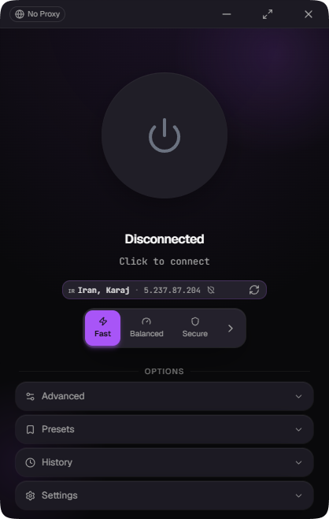

<div dir="rtl">

# Aether-GUI

[](https://github.com/MatinSenPai/Aether-GUI/releases)
[](LICENSE)


[English](README.md) · **فارسی**

یک برنامه‌ی دسکتاپ ساده و «تک‌کلیکی» برای [**Aether**](https://github.com/CluvexStudio/Aether)؛ همان ابزار عبور از سانسور که مخصوص شبکه‌های خیلی محدود ساخته شده. خودِ Aether یک ابزار خط‌فرمانی (ترمینالی) است: یک مسیر باز به بیرون پیدا می‌کند، یک تونل رمزنگاری‌شده برقرار می‌کند و یک پراکسی SOCKS5 روی سیستم خودتان باز می‌کند. کاری که Aether-GUI می‌کند این است که همه‌ی این‌ها را داخل یک برنامه‌ی گرافیکی کوچک و خوش‌دست می‌گذارد تا دیگر لازم نباشد با ترمینال سر و کله بزنید — فقط دکمه‌ی اتصال را بزنید، بقیه‌اش (ساختن هویت، پیدا کردن مسیر، جواب دادن به سؤال‌های برنامه) خودکار پشت صحنه انجام می‌شود.

این پروژه هیچ بخشی از منطقِ تونل‌زنی Aether را از نو ننوشته. فقط فایل واقعیِ `aether` را داخل یک شبه‌ترمینال اجرا می‌کند، به سؤال‌های اولیه‌اش جای شما جواب می‌دهد و خروجی‌اش را می‌خواند تا به شما بگوید چه خبر است. کارِ اصلیِ عبور از سانسور — رمزنگاری، پنهان‌سازی ترافیک با MASQUE/QUIC، WireGuard و جست‌وجوی مسیر — همه مالِ [Aether](https://github.com/CluvexStudio/Aether) است، نه این مخزن.

<div align="center">
  
</div>

## نسخه‌ها و ترمیم موتور

**Aether-GUI 0.17.1** نسخه‌ی برنامه‌ی دسکتاپ است؛ **Aether 2.0.0** نسخه‌ی جداگانه‌ی موتور موردنیاز آن است. فایل [`src-tauri/aether-release.json`](src-tauri/aether-release.json) مخزن بالادستی، نسخه، نام بسته‌ها و checksumهای SHA-256 را برای دریافت در محیط توسعه، CI و ترمیم موتور از داخل برنامه ثابت می‌کند. ترمیم موتور همین نسخه‌ی تأییدشده را نصب می‌کند، نه هر نسخه‌ای که بالادست آن را `latest` نامیده باشد.

اگر موتور موجود نیست، ناسازگار است یا فایل همراه `pt/lyrebird` را ندارد، Aether را متوقف کنید و از گزینه‌ی نصب/ترمیم موتور در برنامه استفاده کنید. این قابلیت بسته‌ی کامل را پس از بررسی checksum در `<app-data>/binaries/engine-2.0.0/` نصب می‌کند. انتخاب‌کننده‌ی موتور، نسخه‌ی دانلودشده‌ی سازگار در پوشه‌ی نسخه‌دار را بر نسخه‌های همراه یا قدیمی مقدم می‌داند؛ بنابراین یک موتور قدیمی مانع استفاده از نصب ترمیم‌شده نمی‌شود. جایگزینی ابتدا در پوشه‌ی موقت آماده می‌شود و پوشه‌ی قبلی به‌صورت نسخه‌ی پشتیبان در کنار آن باقی می‌ماند. باینری‌های قدیمی، فایل‌های هویت و بسته‌ی مستقل Tor مربوط به تغییردهنده‌ی IP حذف نمی‌شوند. بخش About نسخه‌ی شناسایی‌شده‌ی موتور را جدا از نسخه‌ی رابط گرافیکی نمایش می‌دهد.

## امکانات

- **حالت خودکار (Auto)** — صفحه‌ی اصلی فقط یک دکمه است. لازم نیست چیزی تنظیم کنید؛ با آخرین تنظیماتی که برایتان جواب داده وصل می‌شود (یا در اولین اجرا، با یک تنظیمات پیش‌فرضِ معقول).
- **پنل پیشرفته** — اگر خواستید خودتان کنترل داشته باشید، یک پنل بازشونده همان گزینه‌هایی را که Aether واقعاً می‌پرسد در اختیارتان می‌گذارد:
  - **پروتکل**: MASQUE (ترافیک را شبیه HTTPS معمولی جا می‌زند)، WireGuard (سبک‌تر و سریع‌تر) یا WARP-in-WARP/gool (دو تونل WireGuard تو در تو، امنیت بیشتر به قیمت کمی افت سرعت)
  - **حالت اسکن**: Turbo، Balanced، Thorough، Stealth یا Ironclad — یعنی این‌که چقدر سریع دنبال مسیر بگردد در برابر این‌که چقدر ترافیکِ کاوش تولید کند؛ Ironclad برای هر کاندیدا یک تونل واقعی باز می‌کند و یک درخواست HTTP واقعی می‌فرستد و فقط بعدش به آن اعتماد می‌کند (کندتر؛ بدون تضمین اتصال در شبکه‌ی شما)
  - **نسخه‌ی IP**: IPv4، IPv6 یا هر دو
  - **ترنسپورت MASQUE**: HTTP/3 (روی QUIC — سریع‌ترین دست‌دهی) یا HTTP/2 (روی TCP — شبیه HTTPS معمولی؛ برای شبکه‌هایی که UDP را مسدود یا کند می‌کنند)
  - **مبهم‌سازی (Obfuscation)**: این‌که دست‌دهی چقدر از دید DPI پنهان شود — پروفایل‌ها بسته به پروتکلِ انتخابی عوض می‌شوند؛ اگر پیش‌فرض رد نشد، سنگین‌ترش را امتحان کنید
  - **اتصال سریع (Quick reconnect)**: آخرین دروازه‌ای که جواب داده را به خاطر می‌سپارد و دفعه‌ی بعد اول همان را امتحان می‌کند تا اسکن کامل لازم نشود
  - **DNS تونل**: سرورهای DNS استفاده‌شده داخل تونل را انتخاب کنید (پیش‌فرض ۱٫۱٫۱٫۱، ۱٫۰٫۰٫۱)
  - **پروکسی بالادست (Upstream)**: زنجیره‌کردن Aether پشتِ پروکسی یا برنامه‌ی VPN دیگری که همین حالا روی سیستم اجراست (`--upstream`) — پروکسی SOCKS5 همه‌ی ترنسپورت‌ها را عبور می‌دهد، پروکسی HTTP فقط MASQUE روی HTTP/2 را
  - **مسیریابی (Routing)**: لیستِ بلاک و لیستِ مستقیم (دامنه، شبکه، پورت) برای این‌که آدرس‌هایی را کاملاً رد کنید یا آن‌ها را بدون عبور از تونل مستقیم بفرستید
  - **Zero Trust**: پیوستن به سازمان Zero Trust کلادفلر با نام تیم، با ورود با ایمیل، توکن سرویس یا JWT، و مسیریابی اختیاری از Gateway

  کنارِ هر گزینه، با نگه‌داشتن نشانگر ماوس، یک توضیح کوتاه می‌بینید.
- **نمایش پیشرفت زنده** — تا وقتی Aether دنبال مسیرِ سالم می‌گردد، برنامه زمانِ سپری‌شده و — به‌محضِ این‌که Aether بودجه‌ی اسکنش را اعلام کند — درصد و نوار پیشرفتِ واقعی نشان می‌دهد، نه فقط یک چرخنده‌ی بی‌معنی.
- **اتصال مجددِ خودکار** — اگر وسط کار تونل ناگهان قطع شد (بیشتر با WARP-in-WARP دیده شده، ولی برای هر سه پروتکل یک‌جور مدیریت می‌شود)، برنامه خودش با کمی مکث دوباره تلاش می‌کند و به‌شکلِ «در حال اتصال مجدد… (تلاش N از ۳)» نشانش می‌دهد؛ نه این‌که بی‌صدا بمیرد یا شما را پرت کند به یک خطای خشک‌وخالی. البته اگر خودتان دستی قطع کرده باشید، دیگر تلاشِ مجدد نمی‌کند.
- **موقعیت خروجی و تست نشت (Leak check)** — وقتی وصل هستید، یک نشانگر کوچک IP عمومی، کشور و شهری را نشان می‌دهد که ترافیک شما واقعاً از آن‌جا خارج می‌شود (خروجیِ تونل)، و با یک کلیک دوباره بررســیش می‌کند. در هر اتصال، برنامه آن IP خروجی را با IP مستقیمِ واقعیِ سیستم‌تان مقایسه می‌کند؛ اگر یکی باشند، هشدارِ واضحِ «نشت تشخیص داده شد» می‌آید تا فوراً بفهمید تونل دارد ترافیک‌تان را واقعاً پنهان می‌کند یا نه.
- **تاریخچه‌ی اتصال** — هر جلسه ثبت می‌شود (پروتکل، حالت اسکن، مدت، زمان، موفق/ناموفق بودن) داخل یک پنل بازشونده که می‌توانید پاکش کنید؛ تا ببینید چه چیزی برایتان جواب داده.
- **پنجره‌ی لاگ زنده** — خروجی کاملِ Aether را می‌توانید در یک پنجره‌ی جداگانه و قابل‌تغییرسایز باز کنید که حتی وقتی صفحه‌ی اصلی در فوکوس نیست هم زنده می‌ماند؛ برای این‌که دقیق ببینید یک تلاشِ اتصال واقعاً چه کرده است به درد می‌خورد.
- **Tor بومی موتور (Aether 2.0.0)** — با arti داخل خود موتور پیاده‌سازی شده و حالت‌های **Tor** (WARP → Tor)، **Tor-Reverse** (Tor → WARP) و **Tor-Only** (بدون WARP)، سیاست پل و تنظیمات ترنسپورت قابل‌اتصال را ارائه می‌دهد. حالت Tor یک شنونده‌ی SOCKS جدا دارد (پیش‌فرض `127.0.0.1:1820`) که آمادگی آن مستقل از شنونده‌ی اصلی (پیش‌فرض `127.0.0.1:1819`) گزارش می‌شود. Tor-Only از شنونده‌ی اصلی استفاده می‌کند؛ Tor-Reverse از Tor در مسیر داخلی استفاده می‌کند و به MASQUE روی HTTP/2 نیاز دارد، نه WireGuard/gool. فایل `pt/lyrebird` موتور یک ابزار ترنسپورت است، نه باینری Tor تغییردهنده‌ی IP. فعال‌کردن یکی از این دو زیرسیستم، دیگری را اجرا نمی‌کند.
- **تغییردهنده‌ی IP** — یک فرایند مستقلِ Tor که به‌درخواست شما یا به‌صورت خودکار، یک IP خروجیِ عمومیِ تازه به‌تان می‌دهد. از روی پنل Tor را اجرا کنید تا IP فعلیِ خروجی‌تان (کشور، شهر، ارائه‌دهنده) را در حالِ حل‌شدن ببینید، دکمه‌ی **Rotate IP** را بزنید تا هویتِ جدید (NEWNYM) بگیرید، یا **Auto-rotate** را روشن کنید تا هر ۱ تا ۶۰ دقیقه خودکار انجام شود. کاملاً جدا از Aether روی پورت‌های SOCKS5 و کنترلِ خودش کار می‌کند و لاگِ زنده هم داخل همان پنل است.

## تنظیمات

جدا از صفحه‌ی اتصال و پروفایلِ پیشرفته، یک پنل «تنظیمات» هم هست که قسمت‌های سیستمیِ برنامه را سامان می‌دهد:

- **حالتِ گرفته‌شدن ترافیک (Capture mode)** — ترافیک را یا از طریق **پراکسی سیستمی** بگیرید (فقط برنامه‌هایی که به آن احترام می‌گذارند) یا — روی ویندوز — از طریق آداپتور مجازیِ **TUN** که همه‌ی ترافیک را می‌گیرد (فعلاً در رابط کاربری قفل‌شده تا کامل وصل شود). حالتِ حلِ DNS هم همین‌جا انتخاب می‌شود.
- **چیزهای سیستمی** — پنجره را همیشه بالای همه نگه‌دارید، با شروعِ ویند اجرا شوید، موقع شروع مستقیم توی سینی (tray) کوچک شوید، یا با بستن به‌جای خارج شدن توی سینی بروید.
- **ظاهر** — حالت روشن/تیره به‌علاوه‌ی رنگِ خاص خودتان، متناسب با هر پروفایل.
- **آشنا/برون‌برد** — کل تنظیماتان را در یک فایل ذخیره و روی یک سیستم دیگر بازیابی کنید، و داخل خودِ برنامه هم آپدیتِ جدید را چک کنید.

## نصب

جدیدترین نصب‌کننده را از [صفحه‌ی Releases](https://github.com/MatinSenPai/Aether-GUI/releases) بردارید:

- `Aether-GUI_x.y.z_x64-setup.exe` — نصب‌کننده‌ی معمولی (پیشنهادی)
- `Aether-GUI_x.y.z_x64_en-US.msi` — بسته‌ی MSI، برای نصبِ اسکریپتی/سازمانی

فعلاً فقط ویندوز ۶۴بیتی — برای بقیه‌ی سیستم‌عامل‌ها بخشِ «ساختن از روی سورس» را ببینید.

## ساختن از روی سورس

۱. **پیش‌نیازها**
   - [Node.js](https://nodejs.org/) و npm
   - [Rust](https://rustup.rs/) (نسخه‌ی stable)
   - پیش‌نیازهای Tauri برای سیستم‌عاملتان — [راهنمای پیش‌نیازهای Tauri v2](https://v2.tauri.app/start/prerequisites/) (روی ویندوز یعنی MSVC C++ Build Tools و WebView2 Runtime که معمولاً از قبل نصب‌اند؛ روی macOS یعنی Xcode Command Line Tools؛ روی لینوکس یعنی `webkit2gtk` و رفقایش)

۲. **نصب وابستگی‌های فرانت‌اند**

   ```sh
   npm install
   ```

۳. **گرفتن فایل باینری Aether**

   Aether-GUI موتور ازپیش‌ساخته‌شده را از [ریلیزهای CluvexStudio/Aether](https://github.com/CluvexStudio/Aether/releases) همراه خود قرار می‌دهد. از ریشه‌ی مخزن، ابزار مشترک پایتون را اجرا کنید (Python 3.9 یا جدیدتر؛ بدون نیاز به بسته‌ی اضافی پایتون):

   ```sh
   python src-tauri/binaries/fetch-aether.py
   ```

   روی ویندوز، واسط PowerShell همین ابزار را اجرا می‌کند:

   ```powershell
   ./src-tauri/binaries/fetch-aether.ps1
   ```

   روی لینوکس/macOS از `python3 src-tauri/binaries/fetch-aether.py` یا `bash src-tauri/binaries/fetch-aether.sh` استفاده کنید. مانیفست بسته‌ی Windows x86_64، Linux x86_64/aarch64 (musl) یا macOS x86_64/aarch64 را انتخاب می‌کند. متغیر `AETHER_ASSET` می‌تواند بسته‌ی ثابت‌شده‌ی دیگری برای همان سیستم‌عامل، مثلاً بسته‌ی macOS x86_64 برای ساخت با معماری متفاوت، انتخاب کند؛ این متغیر برای انتخاب یک ریلیز دلخواه نیست.

   ابزار، SHA-256 آرشیو را با مانیفست مقایسه می‌کند، اعضای ناامن یا غیرمنتظره‌ی آرشیو را رد می‌کند، معماری هر دو فایل اجرایی را بررسی می‌کند و بسته‌ی کامل را در `src-tauri/binaries/engine/` آماده می‌کند. روی ویندوز `aether.exe` باید کنار `pt/lyrebird.exe` و روی یونیکس `aether` کنار `pt/lyrebird` باشد — کپی‌کردن فقط فایل اصلی کافی نیست. برای معماری بومی، ابزار `aether --version` را هم بررسی می‌کند؛ این کار آزمایش اتصال واقعی نیست. پوشه‌های قبلی موتور به‌صورت پشتیبان در کنار نصب جدید نگه داشته می‌شوند؛ باینری‌های قدیمی در ریشه، فایل‌های هویت/وضعیت، Wintun و `binaries/tor/` دست‌نخورده می‌مانند. فایل‌های TOML هویتِ ساخته‌شده را نخوانید و وارد گیت نکنید.

۴. **فراهم‌کردن بسته‌ی مستقل Tor expert bundle (فقط برای تغییردهنده‌ی IP)**

   پنلِ تغییردهنده‌ی IP با یک [Tor](https://www.torproject.org/) اکسرت باندلِ همراه، نه مرورگر Tor، کار می‌کند. فایلِ `tor-expert-bundle-*` مربوط به سیستمتان را از [صفحه‌ی دانلود Tor](https://www.torproject.org/dist/) بگیرید و باینریِ `tor` (روی ویندوز `tor.exe`) را داخل `src-tauri/binaries/tor/` بگذارید (مثلاً `binaries/tor/windows/x86_64/tor.exe`). تا وقتی این فایل نباشد، پنل ساده می‌گوید «فایل Tor پیدا نشد».

۵. **اجرا در حالت توسعه**

   ```sh
   npm run tauri dev
   ```

۶. **ساختن نصب‌کننده‌ی نهایی**

   ```sh
   npm run tauri build
   ```

   پیکربندی بسته‌بندی برای ویندوز NSIS `.exe` و `.msi`، برای macOS خروجی `.dmg`/`.app` و برای لینوکس `.deb`/`.AppImage`/`.rpm` را هدف می‌گیرد. خروجی‌ها معمولاً زیر `src-tauri/target/release/bundle/` قرار می‌گیرند (با `--target` در زیرپوشه‌ی مخصوص هدف). هر پلتفرم باید روی همان سیستم‌عامل یا runner متناظر CI ساخته شود. مانیفست و پیکربندی‌های پلتفرم فقط پشتیبانیِ درنظرگرفته‌شده را توصیف می‌کنند؛ این مستندات ادعای ساخت موفق، تأیید پلتفرم‌ها یا اتصال واقعی به شبکه ندارند.

## پشت صحنه چطور کار می‌کند

- **فرانت‌اند**: React 19 و Tailwind v4، مدیریت وضعیت با Zustand و انیمیشن‌ها با [Motion](https://motion.dev/) — همه از طریق IPCِ Tauri با بک‌اند Rust حرف می‌زنند. عمداً سبک نگهش داشته‌ایم: پس‌زمینه فقط دو هاله‌ی گرادیانیِ CSS است و وقتی پنجره در فوکوس نباشد همه‌ی انیمیشن‌های تکرارشونده هم متوقف می‌شوند تا برنامه در پس‌زمینه تقریباً هیچ CPUیی مصرف نکند.
- **بک‌اند**: Rust، با استفاده از [`portable-pty`](https://docs.rs/portable-pty) که فایل واقعیِ `aether` (نسخه‌ی ثابت‌شده‌ی 2.0.0) را داخل یک شبه‌ترمینالِ واقعی اجرا می‌کند. تنظیمات انتخابی شما — پروتکل، حالت اسکن، نسخه‌ی IP، ترنسپورتِ MASQUE (HTTP/3 یا HTTP/2)، پروفایل مبهم‌سازی، اتصال سریع، پروکسی بالادست، ایندپوینت‌های WARP-in-WARP، DNS تونل، قوانین مسیریابی و پیوستنِ Zero Trust — از همان اول به‌صورت فلگ‌های خط فرمان و متغیر محیطی به Aether داده می‌شود، پس معمولاً هیچ سؤال تعاملی‌ای ظاهر نمی‌شود؛ با این حال یک ریسه در پس‌زمینه خروجی را می‌پاید و اگر سؤالی هم پیش بیاید جوابش را می‌دهد — و در همان حال هر خط را زنده به پنل لاگِ برنامه می‌فرستد. **تغییردهنده‌ی IP** یک زیرسیستمِ کاملاً جدا است: `ip_changer.rs` یک Tor را روی پورت‌های SOCKS5 (9050) و کنترل (9051) خودش اجرا می‌کند، با [پروتکل کنترلِ Tor](https://spec.torproject.org/control-spec/) روی لوپ‌بک و احراز هویتِ کوکی (`SIGNAL NEWNYM` / `SIGNAL SHUTDOWN`) و برای نمایشِ IP خروجیِ زنده، از همین ایندپوینت‌های `net.rs` تستِ نشت از طریق پراکسیِ `socks5h` استفاده می‌کند.
- **معیار وضعیت «متصل»**: برنامه به‌جای تکیه بر متن شکننده‌ی لاگ، شنونده‌ی اصلی SOCKS5 محلیِ پروفایل را بررسی می‌کند (پیش‌فرض `127.0.0.1:1819`). این بررسی فقط آمادگی شنونده‌ی محلی را نشان می‌دهد، نه اتصال سرتاسری به اینترنت یا محافظت در برابر نشت. شنونده‌ی ثانویه‌ی Tor بومی وضعیت آمادگی جداگانه دارد؛ تغییردهنده‌ی IP از هر دو مستقل است.
- **ماشین وضعیت**: `Idle ← Launching ← Connecting ← Connected`، به‌علاوه‌ی `Reconnecting` و `Error` به‌عنوان دو حالتی که ممکن است سرِ یک تلاشِ اتصال به توجهِ شما نیاز پیدا کنند — `Reconnecting` خودش (با مکث و تا سقفِ ۳ بار) دوباره تلاش می‌کند و `Error` حرفِ آخر است، وقتی تلاش‌ها ته کشیده یا مشکل اصلاً قابل‌تلاش‌مجدد نیست (مثلاً خودِ فایل باینری غایب است).

## درباره‌ی Aether

[Aether](https://github.com/CluvexStudio/Aether) همان موتورِ واقعیِ عبور از سانسور است که این برنامه دورش را می‌گیرد — یک ابزار ترمینالیِ مستقل که مسیرهای قابل‌دسترس را پیدا و تونل را برقرار می‌کند، جدا از هر رابط گرافیکی. اگر ترجیح می‌دهید مستقیم از ترمینال استفاده کنید، یا می‌خواهید دقیق بدانید زیر کاپوت چه خبر است، همان مخزن جایی است که باید بخوانید. Aether-GUI فقط برای این وجود دارد که آن ابزار را برای کسانی که دوست ندارند در ترمینال زندگی کنند، یک‌کلیکی کند.

## مجوز

[GNU Affero General Public License v3.0](LICENSE).

</div>
