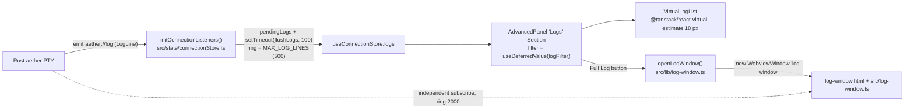
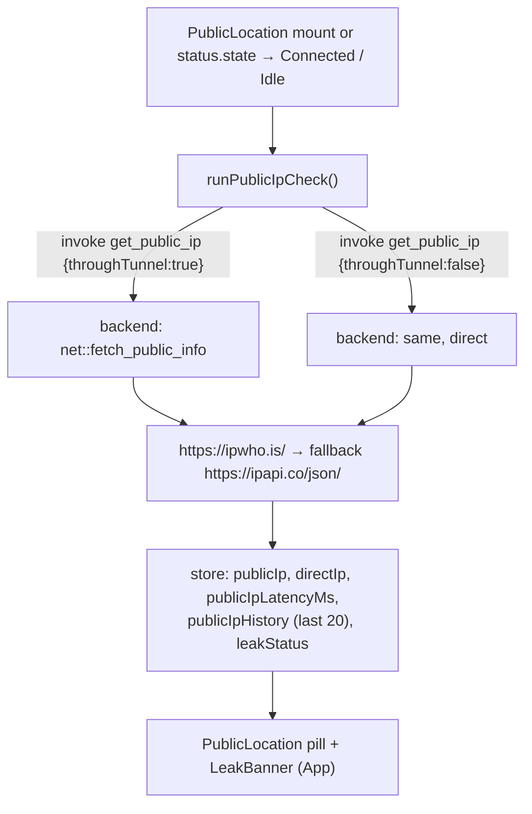
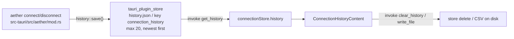
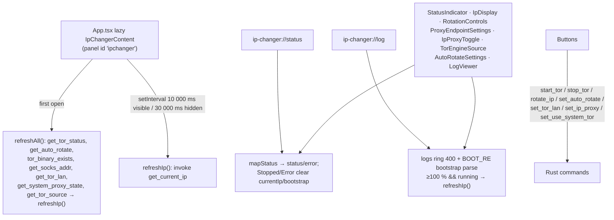

# Monitoring, visuals, log window & IP-Changer UI (slice 05)

Read-only survey of the visual/monitoring half of the React frontend: the log viewer stack (in-panel + separate window), connection-history panel, public-IP / leak indicator, connected-state proxy buttons, notification banner, status indicators, decorative visuals (three.js rings + CSS ambient background) and the whole `ip-changer` panel tree.

## File inventory

| path | ~size | purpose |
| --- | --- | --- |
| `src/components/VirtualLogList.tsx` | 219 L | Virtualized log renderer (`@tanstack/react-virtual`): level colouring, filter highlight, auto-scroll, "Jump to bottom", per-line copy, `.log` export via `save` + `write_file`. |
| `src/components/LogSearch.tsx` | 33 L | Dumb controlled filter input (`placeholder="Filter logs…"`) with clear (X) button. |
| `src/components/ConnectionHistory.tsx` | 2 L | Barrel: re-exports `ConnectionHistoryContent` as `ConnectionHistory` and by name (no usages found). |
| `src/components/ConnectionHistoryContent.tsx` | 201 L | History panel: load/clear/refresh, stats grid, duration sparkline, entry list, two-step clear, CSV export. |
| `src/components/ConnectionInfo.tsx` | 87 L | Connected-state badge card (bridge addr, protocol, TUN, scan mode, obfuscation, IP version) — **no mount site found**. |
| `src/components/PublicLocation.tsx` | 119 L | Location/IP pill: flag, place, exit IP, latency + sparkline, leak shield, re-check button; triggers IP checks on status transitions. |
| `src/components/PacUrl.tsx` | 68 L | Builds a `data:` PAC URL (SOCKS5 + LAN DIRECT rules) and copies it; Connected-only. |
| `src/components/CopyProxyButton.tsx` | 65 L | Copies `bridge_addr` (SOCKS5) to clipboard with 1.5 s "Copied!" swap; Connected-only. |
| `src/components/NotificationBanner.tsx` | 77 L | One-time OS-notification permission prompt persisted in `localStorage`. |
| `src/components/MagicRings.tsx` | 276 L | three.js WebGL2 full-screen shader rings animation (lazy, connecting state only). |
| `src/components/AmbientBackground.tsx` | 43 L | CSS radial gradient + two drifting orbs, paused when the window is unfocused. |
| `src/components/GlassAccordion.tsx` | 90 L | Controlled `Collapsible` panel chrome with icon/label/count/chevron — **no mount site found**. |
| `src/components/CountryFlag.tsx` | 26 L | Renders 18×12 SVG flag from `country-flag-icons` by ISO2 code; `Globe` fallback. |
| `src/components/TunIndicator.tsx` | 29 L | Polls `get_tun_active` every 3 s, shows `TUN` badge when active — **no mount site found**. |
| `src/components/ProxyIndicator.tsx` | 47 L | Polls `get_system_proxy_state` every 3 s, shows `Proxy:<port>` / `No Proxy`; exports `SystemProxyState`. |
| `src/components/ip-changer/IpChangerPanel.tsx` | 62 L | Panel shell: first-open `refreshAll()`, visibility-aware 10 s/30 s IP poll, four `Section`s. |
| `src/components/ip-changer/IpDisplay.tsx` | 98 L | Exit IP card with bootstrap progress bar, place/org, rotation age + "new identity ×N". |
| `src/components/ip-changer/StatusIndicator.tsx` | 29 L | Status dot + label (`Stopped/Starting…/Running/Stopping…/Error`). |
| `src/components/ip-changer/LogViewer.tsx` | 91 L | Non-virtual Tor log list (h-36), stick-to-bottom, copy-all, clear, empty state. |
| `src/components/ip-changer/RotationControls.tsx` | 68 L | Start Tor / Stop + Rotate IP buttons and error box. |
| `src/components/ip-changer/AutoRotateSettings.tsx` | 66 L | Auto-rotate switch + minute interval select (`[1,2,5,10,15,30,60]`). |
| `src/components/ip-changer/ProxyEndpointSettings.tsx` | 90 L | SOCKS endpoint read-out, LAN switch, `IpProxyToggle` system-proxy switch. |
| `src/components/ip-changer/TorEngineSource.tsx` | 48 L | Bundled vs system Tor switch, rendered only when a system Tor exists. |

Supporting sources read for this report (not part of the inventory): `src/lib/log-window.ts`, `src/log-window.ts`, `log-window.html`, `src/state/connectionStore.ts`, `src/stores/ipChangerStore.ts`, `src/state/windowFocus.ts`, `src/types/connection.ts`, `src/types/ipChanger.ts`, `src/types/three.d.ts`, `src/lib/location.ts`, `src/components/AdvancedPanel.tsx`, `src/components/ConnectButton.tsx`, `src/App.tsx`, `vite.config.ts`, `package.json`, `src-tauri/src/history.rs`, `src-tauri/src/net.rs`, `src-tauri/src/commands.rs`, `src-tauri/src/lib.rs`.

## Architecture / data flow

### 1. Main-window log pipeline (React)

Steps:

1. `initConnectionListeners()` (`src/state/connectionStore.ts:416`) registers `listen<LogLine>("aether://log", …)`; lines are pushed into `pendingLogs` and flushed on a 100 ms timer. `flushLogs` appends and truncates: `logs: [...s.logs, ...batch].slice(-MAX_LOG_LINES)` with `const MAX_LOG_LINES = 500` (line 35). It also scans each batch with `const BUDGET_RE = /budget=(\d+)s/` (line 414) and stores `scanBudgetSecs`.
2. `AdvancedPanel` owns `autoScroll` (default `true`), `logFilter`, `deferredFilter = useDeferredValue(logFilter)` and `filteredLogs = useMemo(() => logs.filter(l => l.line.toLowerCase().includes(q)))` (lines 80–110). It renders `LogSearch`, a "Full Log" button (`onClick={() => openLogWindow()}`), a fake file header `aether.log` + `{filteredLogs.length} lines`, then `VirtualLogList`.
3. `VirtualLogList` is presentational only: props `logs: LogLine[]`, `filter: string`, `autoScroll: boolean`, `onAutoScrollChange: (v:boolean)=>void`; it reads no store.

### 2. Separate live-log window (no React, no shared state)

- `openLogWindow()` (`src/lib/log-window.ts`): module-level `let logWindow: WebviewWindow | null`; if already open it calls `isVisible()` → `setFocus()`; else creates `new WebviewWindow("log-window", { url: "/log-window.html", title: "Aether - Live Log", width: 860, height: 560, minWidth: 400, minHeight: 300, center: false, decorations: false, transparent: false, backgroundColor: "#09090b", resizable: true, dragDropEnabled: false })`. The handle is nulled on `tauri://error` and `tauri://close-requested`.
- `log-window.html` is a second Vite rollup input (`vite.config.ts:17`) and loads `/src/log-window.ts`.
- `src/log-window.ts` is a vanilla script that keeps **its own** `const MAX_LINES = 2000` ring (`allLines = allLines.slice(-MAX_LINES); truncated = true`), subscribes to `aether://log` and `aether://status`, and renders by incremental `DocumentFragment` append (full rebuild only when `filterText !== "" || truncated || renderedCount > allLines.length`).
- Consequence: the main window (500 lines, virtualized, zustand) and the log window (2000 lines, DOM, local array) both receive the same Tauri event; there is **no shared log store** between them.

### 3. Public IP / leak check

- Trigger (`src/components/PublicLocation.tsx:21-31`): on first render (`prev === null`) and whenever `status.state` *becomes* `"Connected"` or `"Idle"`.
- `runPublicIpCheck` (`src/state/connectionStore.ts:354-389`): dedupes via `ipCheckInFlight`, aborts the previous request with `AbortController`, then `Promise.all` of `invoke<PublicInfo|null>("get_public_ip", { throughTunnel: connected })` and `{ throughTunnel: false }`. `latencyMs = Math.round(performance.now() - t0)`; `leakStatus` starts `"unavailable"`, and if `connected && tunnel` it is `"none"` (or `"leak"` when `tunnel.ip === direct.ip`, `"none"` when `direct` is null). `publicIpHistory: [...st.publicIpHistory, latencyMs].slice(-20)`.
- Backend (`src-tauri/src/commands.rs:421`) `get_public_ip(through_tunnel)` → `crate::net::fetch_public_info` (`src-tauri/src/net.rs:75`): reqwest client with 8 s timeout, UA `aether-gui/<CARGO_PKG_VERSION> leak-check`, optional `socks5h://<bind_address>` proxy when `through_tunnel`; tries `const ENDPOINT_IPWHO: &str = "https://ipwho.is/"` then `const ENDPOINT_IPAPI: &str = "https://ipapi.co/json/"`. Parsed `PublicInfo { ip, ip_version, country_code, city, org }`.
- `App.tsx` renders `<PublicLocation key={isConnected ? "connected" : "disconnected"} />` (line 121) — the key forces a full remount (and a fresh IP check) on connect/disconnect.

### 4. Connection history

- Store calls: `loadHistory: async () => invoke<ConnectionHistoryEntry[]>("get_history")`, `clearHistory: async () => { await invoke("clear_history"); set({ history: [] }) }` (`src/state/connectionStore.ts:344-352`).
- Persistence (`src-tauri/src/history.rs`): `const STORE_FILE: &str = "history.json"`, `const STORE_KEY: &str = "connection_history"`, `const MAX_ENTRIES: usize = 20`; `save()` does `entries.insert(0, entry)` then `entries.truncate(MAX_ENTRIES)` and `store.save()`.
- Writes happen in the backend on lifecycle transitions (`src-tauri/src/aether/mod.rs:271`, `:601`) with `protocol: format!("{:?}", profile.protocol).to_lowercase()` and `duration_secs = now_millis().saturating_sub(connected_at) / 1000`.
- The component reloads on mount and on the `Connected → Idle` transition via `useConnectionStore.subscribe`.

### 5. Visuals

- `AmbientBackground` sits at the very back of `App.tsx` (`
`, `z-0`) and only toggles `animationPlayState` between `"running"`/`"paused"` from `useWindowFocused()`.
- `MagicRings` is `lazy()`-imported inside `ConnectButton` and rendered only while `phase === "connecting"`, inside a `pointer-events-none fixed inset-0 z-[1]` layer translated so the canvas centres on the button.
- Because it is lazy **and** `vite.config.ts` `manualChunks` returns `"three"` for any `node_modules/three` id, the three.js runtime loads only when a connection attempt starts.

### 6. IP-Changer panel

- Listeners are installed once in `App.tsx` (`initConnectionListeners()` + `initIpChangerListeners()`, cleaned up on unmount) and guarded by `isTauriEnvStore()`.

## Key details

### Log rendering (VirtualLogList)

- Virtualizer config: `count: logs.length`, `getScrollElement: () => parentRef.current`, `estimateSize: () => 18`, `overscan: 12`, and `measureElement` disabled on Firefox (`navigator.userAgent.indexOf("Firefox") === -1` gate).
- Timestamps are rendered relative to the **first line in the current (filtered) array**: `baseTs = logs.length ? logs[0]!.timestamp : 0`, shown as `+{s}s` with `(relMs/1000).toFixed(1)`.
- Level classes (`levelClass`): `/\b(fatal|error)\b/i` or `/\[error\]/i` → `text-red-400`; `/\bwarn\b/i` or `/\[warn\]/i` → `text-amber-400`; `/^\s*\[\+\]/` or `/\binfo\b/i` → `text-emerald-400/70`; else `text-zinc-400 light:text-zinc-600`.
- Highlighting: `escapeRegExp` + `new RegExp(\`(${q})\`, "gi")` split, matches wrapped in `<mark className="rounded bg-primary/25 px-0.5 text-inherit">`. (`const deferredFilter = filter;` at line 57 — the deferral already happened in the parent.)
- Auto-scroll: an effect watches `logs.length`; when `autoScroll` is true it schedules `requestAnimationFrame(() => rowVirtualizer.scrollToIndex(logs.length - 1, { align: "end" }))`. `handleScroll` flips `autoScroll` when `scrollHeight - scrollTop - clientHeight < 24`. A "Jump to bottom" pill is absolutely positioned when `!autoScroll && logs.length > 0`.
- Export: `save({ defaultPath: "aether.log", filters: [{ name: "Log", extensions: ["log", "txt"] }] })` → `invoke("write_file", { path, contents })`. `write_file` is a backend command (`src-tauri/src/commands.rs:349`, plain `std::fs::write`).
- Copy line: `writeText` from `@tauri-apps/plugin-clipboard-manager` + `toast.success("Copied line")`.
- Scroll container: `role="log" aria-label="Aether connection logs"`, `max-h-52 overflow-y-auto`, `font-mono text-[10px]`, `scrollbar-gutter: stable`.
- Empty states: "No matching lines" (with the query echoed) when a filter is active, otherwise `$ aether --connect` + "No logs yet — connect to see output".

### Separate log window

- Controls (ids in `log-window.html`): `searchInput` (placeholder `Filter logs...`), `searchCount`, `autoScrollBtn` (`.active` class), `clearBtn`, `closeBtn`, `lineCount`, `emptyState`, `statusBadge` (initial text `IDLE`), viewport `logViewport`.
- Formatting: its own `interface LogLine { line: string; timestamp: number }`, same `+{s}s` relative prefix, `escapeHtml`, `highlightMatch` (mark uses `color-mix(in srgb,var(--primary) 28%,transparent)`), and its own classifier `getLevelClass`: contains `error`/`failed`/`fatal` → `level-error`, contains `warn` → `level-warn`.
- Counters: `lineCount.textContent = "{filtered}{ / total} lines"`, `searchCount = "{n} matches"`.
- Auto-scroll: `< 24` px from bottom toggles state; button does `scrollTo({ top: scrollHeight, behavior: "smooth" })`.
- Status badge (`src/log-window.ts:157-172`): `statusBadge.textContent = state`, then `colors = { Connected: rgba(34,197,94,0.15)/#4ade80, Error: rgba(248,113,113,0.15)/#f87171, Connecting: rgba(251,191,36,0.15)/#fbbf24, Launching: rgba(251,191,36,0.15)/#fbbf24, Reconnecting: rgba(251,146,60,0.15)/#fb923c }`, default `{ bg: "rgba(99,102,241,0.15)", fg: "#818cf8" }`.

### Connection history UI

- Entry type: `ConnectionHistoryEntry = { protocol: string; scan_mode: string; timestamp: number; duration_secs: number; success: boolean }` (`src/types/connection.ts`), `timestamp` in ms (rendered with `new Date(...).toISOString()` in CSV).
- Stats row: `Success {rate}% {success}/{total}`, `Avg time` (`{avg.toFixed(1)}s` under 60 s else `formatDuration`), `Top {protocol} {topPct}%`.
- `HistorySparkline`: hidden unless `entries.length >= 2`; copies+reverses entries to chronological, min/max normalised with `pad = 3` into `w = 100, h = 28` viewBox; polyline stroke `var(--chart-1)` (`strokeWidth 1.5`), dots `r = success ? 1.8 : 1.2` filled `var(--chart-2)` (success) / `var(--destructive)` (failure), each with a `<title>` "{protocol} {scan_mode} — {secs}s — {time}"; wrapper is `role="img" aria-label="Duration sparkline"` with a "Duration sparkline" label and `{min}s – {max}s` read-out.
- `HistoryEntry`: `motion.li` with `aria-label={"{Connected|Failed} via {protocol}, {scan_mode} mode, lasted {duration}"}`, check/X icon chip, capitalised `protocol` · `scan_mode`, clock + `formatDuration(duration_secs)`, `formatTime(timestamp)` (hidden below `sm`), stagger `delay: Math.min(index * 0.04, 0.24)` on `SPRING_FAST`.
- Local formatters: `formatDuration(secs)` → `{secs}s` / `{m}m {s}s` / `{h}h {m%60}m`; `formatTime(ts)` → `toLocaleString(undefined, { month: "short", day: "numeric", hour: "2-digit", minute: "2-digit" })`.
- CSV: header `timestamp,protocol,scan_mode,duration_secs,success\n`, `save({ defaultPath: "aether-history.csv", filters: [{ name: "CSV", extensions: ["csv"] }] })` → `invoke("write_file", …)`.
- Clear is two-step (`confirmingClear`): "Delete all history?" → "Yes, clear" / "Cancel".

### Public location pill & leak indicators

- Store fields consumed: `status`, `publicIp`, `leakStatus`, `publicIpLoading`, `publicIpLatencyMs`, `publicIpHistory`, `runPublicIpCheck`.
- Renders `null` when `!connected && !publicIp`. Place text: `countryName(publicIp.country_code)` + `, {city}`; fallbacks `"Checking location…"` (loading) / `"Location unavailable"`.
- Shield state (`leakMeta`): `leakStatus === "leak"` → `ShieldAlert` "Leak detected" (`text-status-error`); `"none"` → `ShieldCheck` "Traffic secured" (`text-status-connected`); otherwise `ShieldOff` with "Disconnected" (not connected) or "Check pending".
- Latency: `{latencyMs} ms` plus a 32×12 SVG sparkline of `publicIpHistory` (single point → a `<circle>`), `role="img"` with `aria-label`.
- Re-check button: `aria-label="Re-check IP"`, `disabled={loading}`, spinner class `anim-spin`.
- `countryName()` (`src/lib/location.ts`) is a static ISO2 → English name map; unknown codes fall back to the uppercased code, `null` → `"Unknown"`.
- `CountryFlag`: `import.meta.glob<string>("/node_modules/country-flag-icons/3x2/*.svg", { eager: true, query: "?url&no-inline", import: "default" })`, requires `/^[A-Z]{2}$/`, else `<Globe size={12} aria-hidden>`; ``.
- App-level banner: `isLeaking = leakStatus === "leak" && status.state === "Connected"` (App.tsx:60-62) → `<LeakBanner />` (`role="alert"`, "Leak detected — your real IP is visible", `Disconnect now`, `Re-check`).

### Connected-state buttons

- `CopyProxyButton` / `PacUrl` both `return null` unless `status.state === "Connected"` and both use `const addr = "bridge_addr" in status ? status.bridge_addr : "127.0.0.1:1819"`.
- `CopyProxyButton` title: `Copy SOCKS5 proxy address (${addr}) for manual configuration`; success → `cue("success")`, label swap for **1500 ms** to "Copied!".
- `PacUrl` builds `function FindProxyForURL(url, host) { if (isInNet(host, "127.0.0.0", "255.0.0.0") || isInNet(host, "10.0.0.0", "255.0.0.0") || isInNet(host, "192.168.0.0", "255.255.0.0")) return "DIRECT"; return "SOCKS5 ${addr}; DIRECT"; }` and copies `` `data:application/x-ns-proxy-autoconfig,${encodeURIComponent(pacScript)}` ``; success label "PAC URL copied!" for 1500 ms.
- Both are mounted side by side inside `App.tsx`'s `isConnected` cluster (lines 135–136).

### Notification banner

- `const DISMISSED_KEY = "aether-notif-banner-dismissed"` in `localStorage`.
- On mount: skip if key set; otherwise dynamic `import("@tauri-apps/plugin-notification")` → `isPermissionGranted()`; show only if **not** granted.
- "Allow" → `requestPermission()` and `setVisible(false)`; "No thanks" / X → dismiss without requesting. Both write `"1"` to the key.
- Markup: `role="region" aria-label="Notification permissions request"`, copy "Enable notifications?" / "Get notified when the tunnel connects or drops."; buttons "Allow", "No thanks".
- Actual notifications come from the store's local helper `async function sendNotification(title, body)` (`connectionStore.ts:52`) — dynamic `import("@tauri-apps/plugin-notification")`, `isPermissionGranted()` else `requestPermission()`, then `sendNotification({ title, body })`, all swallowed in `try/catch`. Fires only when `newState !== lastNotifiedState`: `sendNotification("Aether-GUI", \`Connected successfully${modeLabel}\`)` where `modeLabel` is `" (TUN mode)"` / `" (Proxy + TUN)"` from `profile.capture_mode`, `sendNotification("Aether-GUI", \`Connection failed: ${msg}\`)`, `sendNotification("Aether-GUI", "Connection lost, reconnecting...")`.

### Status indicators (3 s polling)

| component | IPC command | interval | shown when |
| --- | --- | --- | --- |
| `TunIndicator` | `get_tun_active` (→ `boolean`) | 3000 ms | `active`; badge text `TUN`, title "TUN adapter active — capturing all traffic" |
| `ProxyIndicator` | `get_system_proxy_state` (→ `SystemProxyState`) | 3000 ms | always; `Proxy:{port}` when `enabled`, else `No Proxy` |

- `export interface SystemProxyState { enabled: boolean; owner: "none" | "main" | "ip_changer"; port: number }` — this type is re-imported by `SystemProxyToggle.tsx`.
- Title strings: `` `System proxy (IP changer) → 127.0.0.1:${state.port}` `` vs `` `System proxy (main tunnel) → 127.0.0.1:${state.port}` ``; inactive → `"System proxy inactive"`.

### Visuals: MagicRings (three.js)

- Dependencies: `three` `^0.180.0` (runtime), `@types/three` `^0.185.1` (dev), plus a hand-written ambient shim `src/types/three.d.ts` (`/* eslint-disable */ declare module "three"`) exposing only `WebGLRenderer`, `Scene`, `OrthographicCamera`, `ShaderMaterial`, `Mesh`, `PlaneGeometry`, `Vector2`, `Color`.
- Shader: inline `vertexShader` / `fragmentShader` strings; constants `const float HP = 1.5707963;` and `const float CYCLE = 3.45;`; ring loop `for (int i = 0; i < 10; i++) { if (i >= uRingCount) break; … }`; alpha `max(c.r, max(c.g, c.b)) * uOpacity`.
- Setup: `new THREE.WebGLRenderer({ alpha: true })` in try/catch (silently no-op on failure), **hard requirement** `renderer.capabilities.isWebGL2` (else `renderer.dispose(); return;`), `setClearColor(0x000000, 0)`, `OrthographicCamera(-0.5, 0.5, 0.5, -0.5, 0.1, 10)` at `z = 1`, one `PlaneGeometry(1, 1)` + `ShaderMaterial({ transparent: true })`.
- Sizing: `dpr = Math.min(window.devicePixelRatio, 2)`, `uResolution = (w*dpr, h*dpr)`, hooked to both `window resize` and a `ResizeObserver`.
- Loop: `frameId = requestAnimationFrame(animate)` re-armed every frame; the body returns immediately when `!focusedRef.current`, so an unfocused window keeps scheduling frames but skips uniform updates and `renderer.render`. Smoothing `* 0.08`, burst decay `*= 0.95`, uniform values refreshed from `propsRef` every frame (props mirrored in `useLayoutEffect`).
- Cleanup cancels the frame, removes the 4 DOM listeners + window `resize`, `ro.disconnect()`, removes the canvas, `renderer.dispose()`, `material.dispose()`.
- Defaults (when props omitted): `color '#f2711c'`, `colorTwo '#fbbf24'`, `speed 1`, `ringCount 6`, `attenuation 10`, `lineThickness 2`, `baseRadius 0.35`, `radiusStep 0.1`, `opacity 1`, `noiseAmount 0.1`, `ringGap 1.5`, `fadeIn 0.7`, `fadeOut 0.5`, `followMouse false`, `parallax 0.05`, `clickBurst false`.
- `ConnectButton` overrides (`src/components/ConnectButton.tsx:149-166`): `speed={1.5} ringCount={3}`, `attenuation={document.documentElement.classList.contains("light") ? 14 : 8}`, `lineThickness={1} baseRadius={0.10} radiusStep={0.09} scaleRate={0.1}`, `opacity={…light ? 0.45 : 0.9}`, `noiseAmount={0} rotation={15} ringGap={1.3} fadeIn={1} fadeOut={0.4} parallax={0.1}`; `color = getAccentColor()`, `colorTwo = lightenHex(raw, 0.35)`, recomputed when `phase` changes.

### Visuals: AmbientBackground & window focus

- Structure: `aria-hidden` wrapper, a static `radial-gradient(110% 72% at 50% -8%, color-mix(in srgb, var(--color-primary) 9%, transparent) 0%, transparent 62%)` layer, then `.anim-orb-a` (`size-72`, `top: -70`, `opacity: 0.11`) and `.anim-orb-b` (`size-48`, `bottom: -36`, `left: -56`, `opacity: 0.06`), both with `willChange: "transform, opacity"`.
- Keyframes come from `src/index.css`: `.anim-orb-a { animation: orb-drift-a 10s ease-in-out infinite; }`, `.anim-orb-b { animation: orb-drift-b 13s ease-in-out infinite; }`; a `prefers-reduced-motion` block sets `animation: none` for `.anim-orb-a/.anim-orb-b` (and siblings).
- Focus source (`src/state/windowFocus.ts`): `useSyncExternalStore` over a module-level `focused` flag fed by `listen<boolean>("app://focused", …)` **and** `getCurrentWindow().onFocusChanged(…)`; debug helper `window.__focus = { state(), events() }`.
- `ConnectButton` uses the same hook (`playState = { animationPlayState: focused ? "running" : "paused" }`).

### Unmounted / unused exports

Verified by repo-wide search — only the defining files matched:

- `ConnectionInfo` — fully implemented connected-state card (`SCAN_LABELS` turbo/balanced/thorough/verified/ironclad, `IP_LABELS` v4/v6/both → IPv4/IPv6/IPv4+6, `getObfuscationLabel` returning `wg_noize` Title-case for wireguard/gool else `masque_noize` UPPERCASE, `showTun = profile.capture_mode === "tun" || "both"`, `addr` fallback `"127.0.0.1:1819"`, `protocol === "auto" ? "MASQUE"`).
- `GlassAccordion` — generic controlled `Collapsible` panel (props `icon, label, open, onToggle, count?, badge?, children`).
- `TunIndicator` — 3 s poll badge.
- `ConnectionHistory.tsx` — barrel re-export; `App.tsx` lazy-imports `ConnectionHistoryContent` directly.
- `IpChangerPanel` (the `props: {open, onToggle}` wrapper next to `IpChangerContent`) — `App.tsx` imports `IpChangerContent`.

Treat these as "exported but not referenced", not as dead code to delete without a repo-wide check outside `src/`.

### IP-Changer UI details

**Panel shell** (`IpChangerContent`): `useRef` guard ensures `refreshAll()` runs once per mount; then `makePoll(document.hidden ? 30000 : 10000)` on `setInterval(refreshIp)`, re-armed on `visibilitychange`. Sections: `Status` (Activity icon → `StatusIndicator`, `IpDisplay`, `RotationControls`), `Proxy` (Network → `ProxyEndpointSettings`, `IpProxyToggle`, `TorEngineSource`), `Auto-rotate` (RefreshCcw → `AutoRotateSettings`), `Logs` (Terminal → `LogViewer`).

**Store** (`src/stores/ipChangerStore.ts`, zustand, separate from `connectionStore`): `const MAX_LOG_LINES = 400`; `logLine()` keeps a rolling array (`logs.slice(-(MAX_LOG_LINES - 1))` + new entry).

Defaults:

| field | default |
| --- | --- |
| `status` | `"stopped"` |
| `error` / `currentIp` / `bootstrapPercent` / `bootstrapPhase` / `_lastProbeNote` | `null` |
| `ipChecking` | `false` |
| `binaryAvailable` | `true` |
| `logs` | `[]` |
| `rotating` / `transitioning` | `false` |
| `lastRotatedAt` | `null` |
| `rotationCount` | `0` |
| `autoRotateEnabled` | `false` |
| `autoRotateIntervalSecs` | `60` |
| `socksAddr` | `{ host: "127.0.0.1", port: 9050 }` |
| `lanEnabled` / `ipProxyEnabled` | `false` |
| `torEngine` | `{ using_system: false, bundled_available: true, system_available: false, system_path: null }` |

Actions → IPC (exact command names as `invoke`d):

| action | command | payload | notes |
| --- | --- | --- | --- |
| `start()` | `start_tor` | — | `transitioning` true/false around it, errors into `error` |
| `stop()` | `stop_tor` | — | same |
| `rotate()` | `rotate_ip` | — | sets `lastRotatedAt = Date.now()`, `rotationCount + 1`, then `setTimeout(refreshIp, 4000)` |
| `refreshIp()` | `get_current_ip` | — | no-op (clears `currentIp`) unless `status === "running"` |
| `setAutoRotate()` | `set_auto_rotate` | `{ intervalSecs, enabled }` | |
| `setLan()` | `set_tor_lan` | `{ enabled }` | then re-reads `get_socks_addr` |
| `setIpProxy()` | `set_ip_proxy` | `{ enabled }` | returns `string \| null` for inline warnings |
| `setTorEngine()` | `set_use_system_tor` | `{ useSystem }` | returns `string \| null` |
| `refreshAll()` | `get_tor_status`, `get_auto_rotate`, `tor_binary_exists`, `get_socks_addr`, `get_tor_lan`, `get_system_proxy_state`, `get_tor_source` | — | `Promise.all`; `ipProxyEnabled = proxy?.owner === "ip_changer"` |

All are registered in `src-tauri/src/lib.rs:187-199` (`ip_changer::*`) except `set_ip_proxy` / `get_system_proxy_state`, registered as `commands::` (`lib.rs:166-167`).

Events:

- `listen<TorStatus>("ip-changer://status", …)` → `mapStatus`: `Running→running`, `Starting→starting`, `Stopping→stopping`, `Stopped→stopped`, `Error→error + s.message`. On `Stopped`/`Error` it also clears `currentIp`, `bootstrapPercent`, `bootstrapPhase`, `_lastProbeNote`.
- `listen<LogLine>("ip-changer://log", …)` → appends to the 400-line ring and parses `const BOOT_RE = /Bootstrapped (\d+)% \((\w+)(?::|\))/` into `bootstrapPercent`/`bootstrapPhase`; a match also resets `_lastProbeNote`, and when `percent >= 100 && status === "running"` it calls `refreshIp()`.

**Component behaviours**

- `StatusIndicator`: `DOT` map — `stopped` "Stopped"/`bg-status-idle`, `starting` "Starting…"/`bg-status-connecting` + `animate-ping`, `running` "Running"/`bg-status-connected`, `stopping` "Stopping…"/`bg-status-connecting` + ping, `error` "Error"/`bg-status-error`.
- `RotationControls`: when running → "Stop" (disabled while `transitioning`) + "Rotate IP" (disabled while `rotating`, swaps to `Loader2` + "Rotating…"); otherwise "Start Tor" (disabled while `transitioning || !binaryAvailable`, swaps to "Starting…"). Error box rendered only when `error && status === "error"`.
- `IpDisplay`: `bootstrapping = running && !currentIp && bootstrapPercent !== null && bootstrapPercent < 100` → progress bar `width: ${bootstrapPercent}%`, label "Tor is bootstrapping…", phase text `bootstrapPhase.replace(/_/g, " ")`, hint "exit IP appears when the circuit is ready". `waiting = running && !ipChecking && !currentIp && !bootstrapping` → "looking up exit IP…". Otherwise `CountryFlag` + `countryName`/city · org, or `MapPin` + "not connected". Footer: `formatRotated(lastRotatedAt)` ("never rotated yet" / "rotated Ns ago" / "rotated N min ago" / "rotated Nh ago") and `new identity ×{rotationCount}` when > 0.
- `refreshIp()` probe notes (logged once per distinct message via `_lastProbeNote`): `[tor] exit IP not reachable yet (tor bootstrapping {p}%)` or `[tor] exit IP lookup: no exit circuit yet — retrying…`.
- `ProxyEndpointSettings` display string: running + LAN → `` `${socksAddr.host}:${socksAddr.port}` ``; running → `` `127.0.0.1:${socksAddr.port}` ``; not running → `` `${lanEnabled ? "0.0.0.0" : "127.0.0.1"}:${socksAddr.port}` ``. "Allow LAN access" switch is `disabled={running}` with `title="Applies on next start"`.
- `IpProxyToggle`: "Set system proxy", `aria-label="Set Windows system proxy to Tor SOCKS"`, `disabled={!running}`, `title="Start Tor to enable the system proxy"` when idle; returned error string shown in a red paragraph.
- `TorEngineSource`: returns `null` unless `engine.system_available`; switch labelled "Tor core" with `aria-label="Run the system Tor package instead of the bundled app Tor"`, `disabled={running}` and `title="Takes effect on next start"`; caption "Running the OS-provided Tor" / "Bundled with the app — switch to the system Tor if it fails here" plus `({engine.system_path})`.
- `AutoRotateSettings`: `const MINUTE_OPTIONS = [1, 2, 5, 10, 15, 30, 60]`; switch `aria-label="Auto-rotate Tor identity"` `disabled={!running}` (`title="Start Tor to enable auto-rotation"`); the "every {n} minute(s)" select only renders when `enabled && running`, and `minuteValue` falls back to `5` if `intervalSecs / 60` isn't in the list.
- `LogViewer`: plain `logs.map(...)` (not `VirtualLogList`), fixed `h-36 overflow-y-auto`, timestamps via `const TIME_FMT = new Intl.DateTimeFormat(undefined, { hour: "2-digit", minute: "2-digit", second: "2-digit" })`; stick-to-bottom using the same `< 24` px threshold; "Copy all logs" uses **`navigator.clipboard.writeText`** (not the Tauri clipboard plugin) with `cue("success")`/`cue("error")`; "Clear Tor logs" → `clearLogs()`; empty state "No output yet" / "Tor output appears here once it starts. Start the engine to see live logs."; every row gets `anim-log-in`.

### Shared constants & quirks worth remembering

- Main log ring **500** (`connectionStore`), separate window **2000**, IP-changer Tor log **400** — three independent buffers.
- Fallback proxy address used by five components: `127.0.0.1:1819` (`CopyProxyButton`, `PacUrl`, `ConnectionInfo`, plus `SystemProxyToggle`/`TrafficStats` outside this slice); the same value is the Rust default (`default_bind_address()` / `DEFAULT_SOCKS_ADDR`, `src-tauri/src/aether/profiles.rs:366`, `src-tauri/src/status.rs:6`).
- Tor SOCKS default is `9050` (ip-changer store), distinct from the tunnel's `1819`.
- Scroll threshold `< 24 px from bottom` = "at bottom" is reused in three places (`VirtualLogList`, `LogViewer`, `log-window.ts`).
- MagicRings bails on non-WebGL2 silently; `three` only ships in its own manual chunk and is lazy-loaded.
- `IpChangerContent`'s IP poll slows from 10 s to 30 s while the document is hidden.

## Links to other sections

- **`App.tsx` shell / chrome (slice 04)** — mounts `NotificationBanner` (l. 98), `LeakBanner` (l. 114), `PublicLocation` (l. 121, keyed on connect state), `TrafficStats` (l. 122), `CopyProxyButton` + `PacUrl` (l. 135-136), `ConnectionHistoryContent` under panel id `"history"` (l. 235-237), `IpChangerContent` under `"ipchanger"` (l. 221-223), `AmbientBackground` (l. 315); `PanelId` union lives in `src/components/AppMenu.tsx:9` (`"advanced" | "presets" | "ipchanger" | "history" | "settings"`).
- **Advanced / connect configuration (slice 03)** — `AdvancedPanel.tsx` "Logs" Section (l. 410-449) is the only host of `LogSearch` + `VirtualLogList` + `openLogWindow()`; `ConnectButton.tsx` is the only host of `MagicRings`.
- **Connection-state store / backend lifecycle (slices 01/02)** — `initConnectionListeners` emits the `aether://status|log|traffic|tor-status|psiphon-status` events consumed here; `runPublicIpCheck` depends on `get_public_ip`; history depends on `get_history` / `clear_history` / `history::save`.
- **Tor/IP-changer backend (slice 02)** — the whole `ip-changer` tree is a thin UI over `ip_changer::{start_tor, stop_tor, rotate_ip, get_current_ip, set_auto_rotate, set_tor_lan, set_use_system_tor, get_tor_source, …}` and `commands::{set_ip_proxy, get_system_proxy_state}`.
- **Title bar (slice 04)** — `TitleBar.tsx` mounts `ProxyIndicator`; `SystemProxyToggle.tsx` imports `SystemProxyState` from `ProxyIndicator.tsx`.
- **Shared helpers** — `@/lib/location` (`countryName`) and `@/components/CountryFlag` are used by both `PublicLocation` and `ip-changer/IpDisplay`; `useWindowFocused` (`src/state/windowFocus.ts`) is shared by `AmbientBackground`, `MagicRings` and `ConnectButton`.
